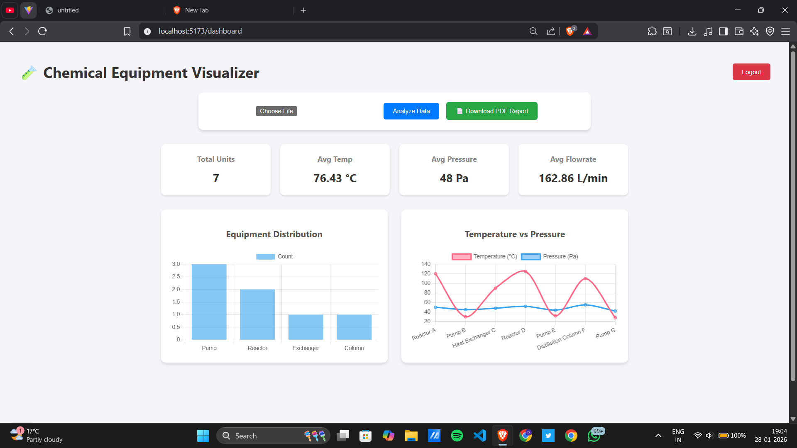
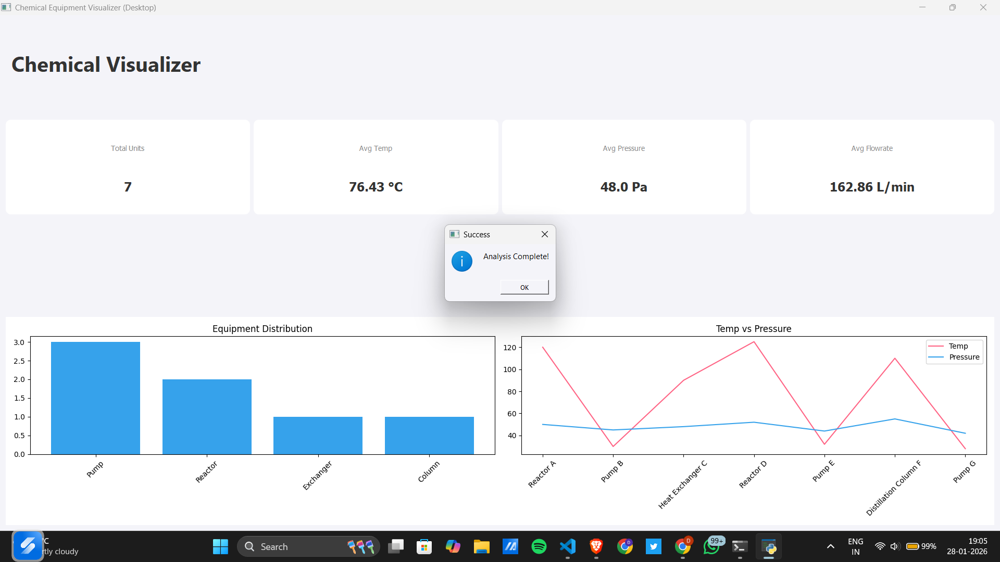

# 🧪 Chemical Equipment Parameter Visualizer


> **A Hybrid Analytics Platform developed for the FOSSEE Summer Fellowship Screening.** > Seamlessly visualizes chemical equipment data across **Web (React)** and **Desktop (PyQt)** environments using a centralized Django API.

---

## 📸 Project Demo

| **Web Dashboard (React + Chart.js)** | **Desktop Client (PyQt5 + Matplotlib)** |
|:------------------------------------:|:---------------------------------------:|
|  |  |
| *Modern, responsive dashboard for remote analytics.* | *Native application for on-premise/offline control.* |

---

## 🚀 Key Features

* **Hybrid Architecture:** A single **Django REST API** serves two distinct frontends (Web & Desktop), ensuring logic consistency.
* **Corporate-Grade Security:** Implements **JWT-style Token Authentication** to secure API endpoints.
* **Clean Code Architecture:** logic is decoupled into a **Service Layer (`services.py`)**, separating business logic from HTTP views for better testability.
* **Automated Reporting:** Generates downloadable **PDF Reports** with statistical summaries on the fly.
* **Data Persistence:** Maintains a history of the last 5 uploads per user using **SQLite**.
* **Advanced Visualization:** * **Web:** Interactive `Chart.js` graphs.
    * **Desktop:** Scientific plotting with `Matplotlib`.

---

## 🛠️ Tech Stack

| Layer | Technology | Purpose |
| :--- | :--- | :--- |
| **Backend** | Django + DRF | REST API, Auth, Business Logic |
| **Data Processing** | Pandas | CSV Parsing, Statistical Analysis |
| **Web Frontend** | React.js + Vite | Responsive Web Dashboard |
| **Desktop Frontend** | PyQt5 | Native GUI Application |
| **Visualization** | Chart.js / Matplotlib | Data Rendering |
| **Database** | SQLite | Lightweight Data Storage |

---

## ⚙️ Installation & Setup Guide

### Prerequisites
* Python 3.8+
* Node.js & npm
* Git

### 1️⃣ Backend Setup (Django)
The backend is the heart of the application. Start it first.

```bash
# Clone the repository
git clone [https://github.com/yourusername/chemical-visualizer.git](https://github.com/yourusername/chemical-visualizer.git)
cd chemical-visualizer/backend

# Create virtual environment (Optional but recommended)
python -m venv venv
# Windows: venv\Scripts\activate
# Mac/Linux: source venv/bin/activate

# Install dependencies
pip install -r requirements.txt

# Run Migrations & Create Admin User
python manage.py migrate
python manage.py createsuperuser  # <--- Create your login credentials here!

# Start Server
python manage.py runserver
Server will run at: http://127.0.0.1:8000/2️⃣ Web Frontend Setup (React)Open a new terminal.Bashcd ../web-frontend

# Install dependencies
npm install

# Run Development Server
npm run dev
Access the Web App at the link provided (usually http://localhost:5173)3️⃣ Desktop App Setup (PyQt)Open a new terminal.Bashcd ../desktop-frontend

# Install GUI dependencies
pip install PyQt5 requests matplotlib

🚀 Run Application
python main.py

📡 API Documentation
```
---

## The backend exposes the following REST endpoints:

| **Method** | **Endpoint** | **Description** |	**Auth Required** |
| POST |	/api/login/ | Obtains Auth Token | ❌ |
| POST | /api/upload/ | Upload CSV & Get Stats | ✅ |
| GET	| /api/report/<id> |	Download Analysis PDF |	✅ |

---

## 🧪 Sample Data

A file named sample_equipment_data.csv is included in the root directory for testing.

## Columns Included:

Equipment Name
Type
Flowrate
Pressure
Temperature

🤝 Contribution

Fork the repository

Create a feature branch

git checkout -b feature/NewFeature


Commit your changes

Push to the branch and open a Pull Request

👨‍💻 Developer

Devansh Bansal
Computer Science Engineering Student
